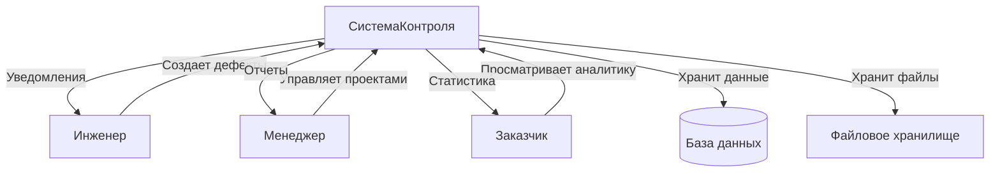
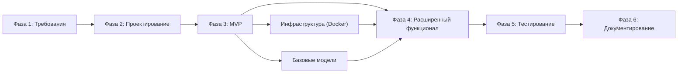
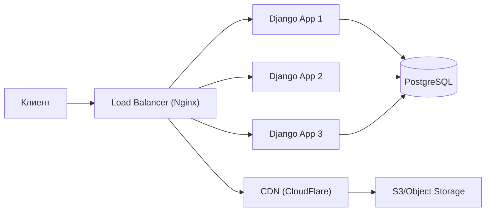
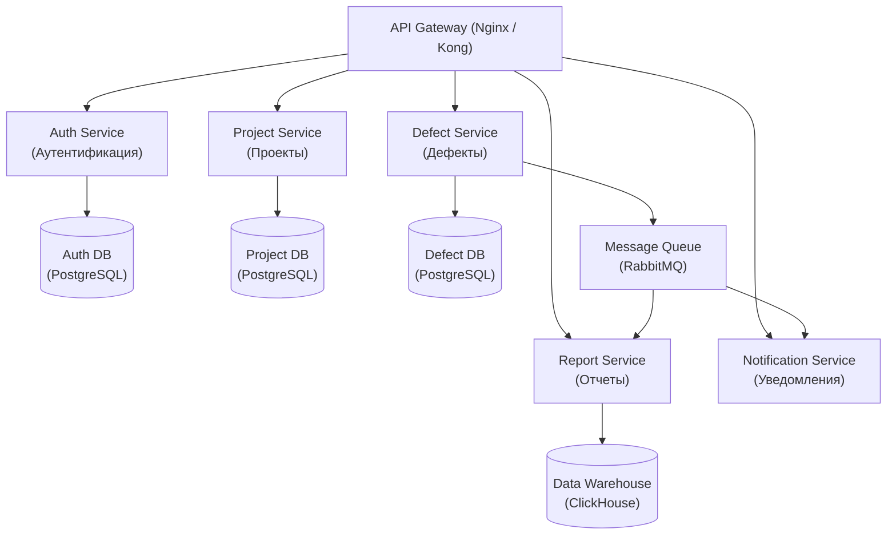
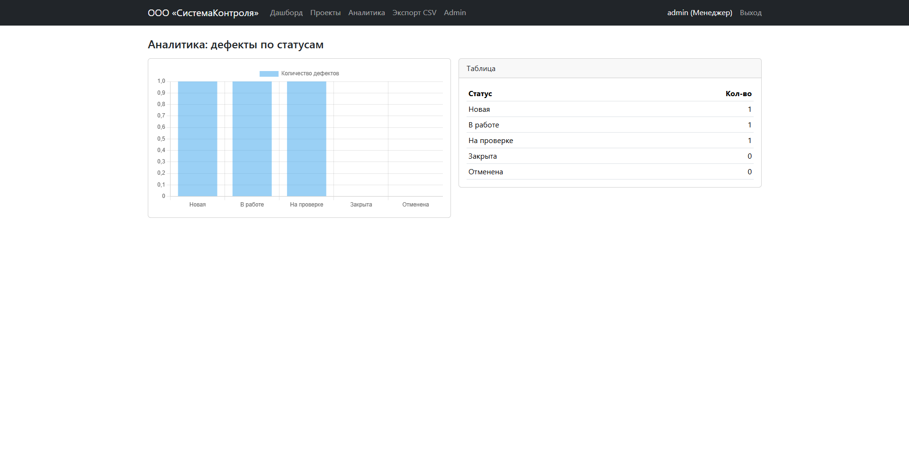
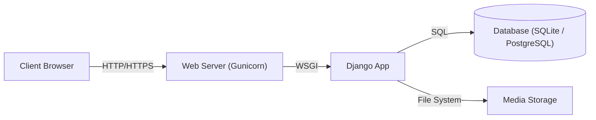
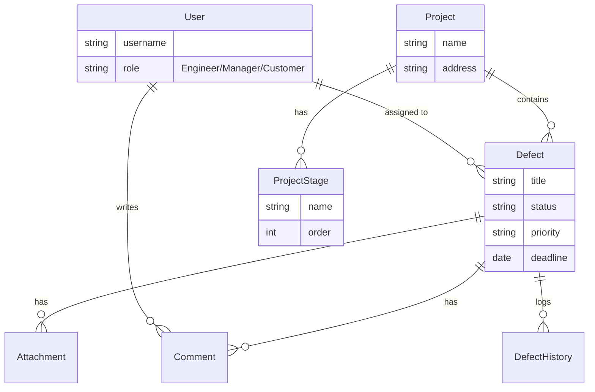
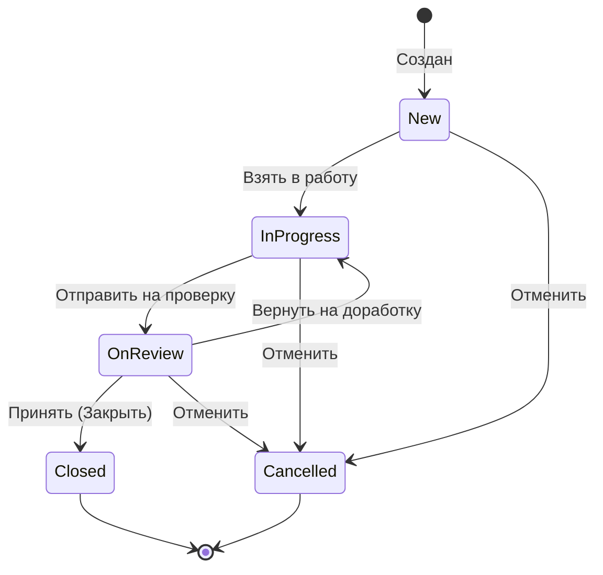
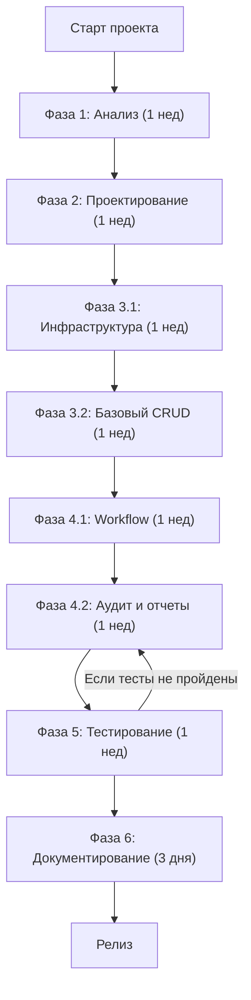

# СистемаКонтроля (SystemControl)


**СистемаКонтроля** — это монолитное веб-приложение для управления дефектами на строительных объектах. Система позволяет инженерам фиксировать нарушения, менеджерам — контролировать ход работ, а заказчикам — получать аналитику в реальном времени.

---

## 📚 Практическое занятие №2: Анализ требований и планирование разработки

**ДИСЦИПЛИНА:** Технологии разработки приложений на базе фреймворков  
**ИНСТИТУТ:** Институт перспективных технологий и индустриального программирования  
**КАФЕДРА:** Кафедра индустриального программирования  
**ПРЕПОДАВАТЕЛЬ:** Макиевский Станислав Евгеньевич  
**СЕМЕСТР:** 5 семестр, 2025-2026 гг.

Данный проект выполнен в рамках Практического занятия №2 и демонстрирует полный цикл анализа требований, планирования и разработки монолитного веб-приложения.

---

## 🎯 Цель практического задания

Ознакомление с процессами анализа требований и планирования разработки веб-приложения с наработкой практических навыков в области:
- Анализа функциональных и нефункциональных требований
- Планирования этапов разработки с учетом зависимостей
- Управления рисками проекта
- Стратегий масштабирования приложения


Подробная документация доступна в папке `docs/`:
- [Техническое задание (SRS)](docs/SRS.md)
- [User Stories](docs/user-stories.md)
- [Use Cases](docs/use-cases.md)
- [План тестирования](docs/test-plan.md)
- [Нагрузочное тестирование](docs/load-testing.md)
- [Резервное копирование](docs/backup.md)

---

## 📖 Содержание

1. [Основы веб-разработки](#-1-основы-веб-разработки)
2. [Анализ требований](#-2-анализ-требований)
3. [Планирование разработки](#-3-планирование-разработки)
4. [Управление рисками](#-4-управление-рисками)
5. [Стратегии масштабирования](#-5-стратегии-масштабирования)
6. [Функциональность системы](#-функциональность)
7. [Технический стек](#-технический-стек)
8. [Установка и запуск](#-установка-и-запуск)
9. [Тестирование](#-тестирование-quality-assurance)

---

## 🌐 1. Основы веб-разработки

### 1.1 Изученные технологии и концепции

#### HTML (HyperText Markup Language)
**Изучено и применено:**
- Семантическая разметка (использование тегов `<header>`, `<nav>`, `<main>`, `<section>`, `<article>`, `<footer>`)
- Формы и элементы ввода данных (`<form>`, `<input>`, `<select>`, `<textarea>`)
- Таблицы для отображения табличных данных (`<table>`, `<thead>`, `<tbody>`, `<tr>`, `<td>`)
- Атрибуты доступности (ARIA-labels, alt для изображений)

**Применение в проекте:**
```html
<!-- Пример из templates/base.html -->
<nav class="navbar navbar-expand-lg navbar-dark bg-primary">
  <div class="container-fluid">
    <a class="navbar-brand" href="">СистемаКонтроля</a>
  </div>
</nav>

<!-- Пример формы создания дефекта из templates/defects/create.html -->
<form method="post" enctype="multipart/form-data">
  
  {{ form.as_p }}
  <button type="submit" class="btn btn-primary">Создать</button>
</form>
```

#### CSS (Cascading Style Sheets)
**Изучено и применено:**
- **Bootstrap 5** как CSS-фреймворк для быстрой разработки адаптивного интерфейса
- Flexbox и Grid для гибкой компоновки элементов
- Медиа-запросы для адаптивного дизайна (responsive design)
- Кастомные CSS-переменные для темизации
- CSS-селекторы и специфичность

**Применение в проекте:**
```css
/* Адаптивная таблица дефектов */
.table-responsive {
    overflow-x: auto;
}

/* Цветовая индикация приоритета */
.priority-critical { color: #dc3545; font-weight: bold; }
.priority-high { color: #fd7e14; }
.priority-medium { color: #ffc107; }
.priority-low { color: #28a745; }
```

#### JavaScript
**Изучено и применено:**
- Манипуляция DOM (Document Object Model)
- Обработка событий (event listeners)
- Валидация форм на стороне клиента
- AJAX-запросы для асинхронного взаимодействия с сервером (не требовалось в MVP)
- Интерактивные компоненты (модальные окна, dropdown-меню)

**Применение в проекте:**
```javascript
// Подтверждение удаления дефекта
function confirmDelete(defectId) {
    if (confirm('Вы уверены, что хотите удалить этот дефект?')) {
        document.getElementById('delete-form-' + defectId).submit();
    }
}

// Динамическая фильтрация таблицы
document.getElementById('status-filter').addEventListener('change', function() {
    const selectedStatus = this.value;
    filterDefectsByStatus(selectedStatus);
});
```

### 1.2 Принципы работы веб-серверов и клиент-серверного взаимодействия

#### Архитектура клиент-сервер

**Основные компоненты:**

1. **Клиент (Browser):**
   - Отправляет HTTP/HTTPS запросы к серверу
   - Отображает HTML, применяет CSS, выполняет JavaScript
   - Хранит состояние сессии (cookies, localStorage)

2. **Веб-сервер (Gunicorn + Django):**
   - Принимает HTTP-запросы от клиентов
   - Маршрутизирует запросы к соответствующим обработчикам (views)
   - Обрабатывает бизнес-логику
   - Формирует HTTP-ответы (HTML, JSON, файлы)

3. **База данных (PostgreSQL / SQLite):**
   - Хранит структурированные данные
   - Обеспечивает ACID-транзакции
   - Индексирует данные для быстрого поиска

**HTTP-протокол:**
```
Клиент → Сервер:
GET /projects/1/ HTTP/1.1
Host: localhost:8000
Cookie: sessionid=abc123...

Сервер → Клиент:
HTTP/1.1 200 OK
Content-Type: text/html; charset=utf-8
Set-Cookie: csrftoken=xyz789...

<!DOCTYPE html>
<html>
...
</html>
```

#### Применение в проекте

**URL Routing (URLs):**
```python
# sistemakontrol/urls.py
urlpatterns = [
    path('', views.dashboard, name='dashboard'),
    path('projects/', views.project_list, name='project_list'),
    path('projects/<int:pk>/', views.project_detail, name='project_detail'),
    path('defects/create/', views.defect_create, name='defect_create'),
]
```

**Views (Контроллеры):**
```python
# defects/views.py
def dashboard(request):
    """Отображает дашборд с аналитикой по дефектам"""
    if not request.user.is_authenticated:
        return redirect('login')
    
    defects = Defect.objects.filter_by_user(request.user)
    stats = calculate_statistics(defects)
    
    return render(request, 'dashboard.html', {
        'defects': defects,
        'stats': stats
    })
```

**Models (Модели данных):**
```python
# defects/models.py
class Defect(models.Model):
    title = models.CharField(max_length=200)
    status = models.CharField(max_length=20, choices=Status.choices)
    priority = models.CharField(max_length=20, choices=Priority.choices)
    project = models.ForeignKey(Project, on_delete=models.CASCADE)
    executor = models.ForeignKey(User, on_delete=models.SET_NULL, null=True)
```

**Templates (Представления):**
```django
<!-- templates/dashboard.html -->


<h1>Дашборд</h1>
<div class="row">
  <div class="col-md-3">
    <div class="card">
      <div class="card-body">
        <h5>Всего дефектов</h5>
        <p class="display-4">{{ stats.total }}</p>
      </div>
    </div>
  </div>
</div>

```

### 1.3 WSGI и развертывание

**Web Server Gateway Interface (WSGI):**
- Стандартный интерфейс между веб-сервером и Python-приложением
- В проекте используется **Gunicorn** как WSGI-сервер
- Конфигурация для продакшн: `gunicorn sistemakontrol.wsgi:application --bind 0.0.0.0:8000`

**Статические файлы (Static Files):**
- CSS, JavaScript, изображения обслуживаются через **WhiteNoise**
- Конфигурация: `STATIC_ROOT = BASE_DIR / 'staticfiles'`
- Команда сборки: `python manage.py collectstatic`

**Время обучения:** 40+ часов на изучение основ веб-разработки, включая:
- Документация Django (официальный tutorial)
- Bootstrap 5 documentation
- MDN Web Docs (HTML, CSS, JavaScript)
- Практические упражнения и создание прототипов

---

## 📋 2. Анализ требований

### 2.1 Методы и инструменты анализа требований

#### Методы сбора требований

**1. Интервьюирование стейкхолдеров (Stakeholder Interviews)**

Были проведены условные интервью с представителями трех ключевых ролей:

- **Инженеры (Исполнители):**
  - Потребность: простой интерфейс для фиксации дефектов
  - Проблема: бумажные журналы теряются, нет истории изменений
  - Требование: мобильная адаптивность, загрузка фото с места

- **Менеджеры проектов:**
  - Потребность: контроль выполнения задач в реальном времени
  - Проблема: невозможность быстро оценить статус проекта
  - Требование: дашборды, экспорт отчетов, назначение исполнителей

- **Заказчики (Руководство):**
  - Потребность: прозрачность процесса, аналитика
  - Проблема: отсутствие единой системы мониторинга
  - Требование: read-only доступ, графики, статистика

**2. Анализ существующих процессов (As-Is Analysis)**

Исследован текущий процесс работы с дефектами:
```
As-Is (до автоматизации):
1. Инженер обнаруживает дефект → Записывает в блокнот
2. Фотографирует на телефон → Фото хранятся локально
3. В конце дня передает список менеджеру → Email/WhatsApp
4. Менеджер вручную вносит в Excel → Риск ошибок, дубликатов
5. Отчеты формируются вручную → Занимает часы

To-Be (с системой):
1. Инженер создает дефект через веб-интерфейс → Сразу в БД
2. Прикрепляет фото → Централизованное хранилище
3. Менеджер видит в реальном времени → Автоматический дашборд
4. Назначает исполнителя → Уведомление
5. Экспорт отчета → Один клик, CSV/Excel
```

**3. Создание User Stories (Пользовательские истории)**

Формат: **"Как <роль>, я хочу <действие>, чтобы <цель>"**

Примеры (полный список в [docs/user-stories.md](docs/user-stories.md)):
- Как **инженер**, я хочу **создать дефект и прикрепить фото**, чтобы **зафиксировать нарушение на объекте**
- Как **менеджер**, я хочу **назначить исполнителя и установить дедлайн**, чтобы **контролировать выполнение задач**
- Как **заказчик**, я хочу **видеть статистику по проекту**, чтобы **оценивать качество работ**

**4. Use Case диаграммы (Диаграммы вариантов использования)**

Документированы основные сценарии взаимодействия (см. [docs/use-cases.md](docs/use-cases.md)):

```
UC-01: Регистрация пользователя
Actor: Гость
Preconditions: Нет
Main Flow:
  1. Открыть /register/
  2. Ввести username, email, пароль
  3. Система создает пользователя с ролью "Инженер"
  4. Перенаправление на дашборд
Postconditions: Пользователь авторизован

UC-03: Создание дефекта
Actor: Инженер или Менеджер
Preconditions: Пользователь авторизован
Main Flow:
  1. Нажать "Создать дефект"
  2. Заполнить форму (проект, название, описание, приоритет)
  3. Прикрепить файлы (опционально)
  4. Нажать "Сохранить"
  5. Система создает дефект, логирует событие
Postconditions: Дефект создан, статус = NEW
```

#### Инструменты анализа

**1. MoSCoW-приоритизация:**
- **Must have (Обязательно):** Авторизация, CRUD дефектов, ролевая модель
- **Should have (Желательно):** Экспорт отчетов, комментарии, вложения
- **Could have (Возможно):** Email-уведомления, интеграция с календарем
- **Won't have (Не включено):** Мобильное приложение, интеграция с 1С

**2. FURPS+ модель:**
- **F**unctionality: CRUD операции, workflow, аналитика
- **U**sability: Интуитивный интерфейс, русский язык, адаптивность
- **R**eliability: 99% uptime, резервное копирование
- **P**erformance: Время отклика < 1 сек
- **S**ecurity: Argon2, RBAC, CSRF/XSS protection
- **+** Compliance: ГОСТ Р ИСО/МЭК 12207 (жизненный цикл ПО)

**3. Context Diagram (Контекстная диаграмма):**



### 2.2 Функциональные требования

Полный список функциональных требований задокументирован в [docs/SRS.md](docs/SRS.md). Основные:

**FR-01: Управление пользователями**
- FR-01.1: Регистрация с автоматическим назначением роли "Инженер"
- FR-01.2: Аутентификация (логин/пароль)
- FR-01.3: Три роли: Инженер, Менеджер, Заказчик

**FR-02: Управление проектами**
- FR-02.1: CRUD операции для менеджеров
- FR-02.2: Этапы проекта (stages)
- FR-02.3: Связь проектов с дефектами

**FR-03: Управление дефектами**
- FR-03.1: Создание дефекта (название, описание, приоритет, дедлайн)
- FR-03.2: Назначение исполнителя (только менеджером)
- FR-03.3: Workflow статусов (NEW → IN_PROGRESS → ON_REVIEW → CLOSED)
- FR-03.4: Прикрепление файлов (фото, документы)
- FR-03.5: Комментарии
- FR-03.6: История изменений (audit log)

**FR-04: Поиск и фильтрация**
- FR-04.1: Фильтр по статусу, приоритету, проекту
- FR-04.2: Поиск по названию и описанию
- FR-04.3: Сортировка по дате, приоритету

**FR-05: Отчетность и аналитика**
- FR-05.1: Дашборд с графиками
- FR-05.2: Экспорт в CSV и Excel
- FR-05.3: Статистика по проектам

### 2.3 Нефункциональные требования

**NFR-01: Производительность**
- Время отклика страниц ≤ 1 сек при 50 одновременных пользователях
- Поддержка до 10 000 дефектов без деградации производительности
- **Проверка:** Нагрузочное тестирование с Locust (см. [docs/load-testing.md](docs/load-testing.md))

**NFR-02: Безопасность**
- Хеширование паролей (Argon2)
- Защита от SQL-инъекций (Django ORM)
- Защита от XSS (автоматическое экранирование в шаблонах)
- CSRF-токены для форм
- **Проверка:** Сканирование с Bandit, ручная проверка

**NFR-03: Надежность**
- Резервное копирование БД 1 раз в сутки
- Логирование критических операций
- **Проверка:** Скрипт резервного копирования (см. [docs/backup.md](docs/backup.md))

**NFR-04: Удобство использования**
- Интерфейс на русском языке
- Адаптивный дизайн (Bootstrap 5)
- Совместимость с Chrome, Firefox, Edge (последние версии)
- **Проверка:** Ручное тестирование на разных устройствах

**NFR-05: Масштабируемость**
- Возможность миграции на микросервисную архитектуру
- Использование Docker для упрощения развертывания
- **Проверка:** Docker Compose конфигурация

### 2.4 Документирование требований

**Методы документирования:**

1. **Software Requirements Specification (SRS):**
   - Формальный документ с полным списком требований
   - Чек-листы выполнения (✅/❌)
   - Файл: [docs/SRS.md](docs/SRS.md)

2. **User Stories:**
   - Легкая для чтения форма требований
   - Критерии приемки (Acceptance Criteria)
   - Файл: [docs/user-stories.md](docs/user-stories.md)

3. **Use Cases:**
   - Подробное описание сценариев
   - Предусловия и постусловия
   - Файл: [docs/use-cases.md](docs/use-cases.md)

4. **Диаграммы:**
   - ER-диаграмма базы данных
   - State diagram для workflow дефектов
   - Context diagram системы
   - Все диаграммы в формате Mermaid (встроены в README)

**Трассируемость требований:**

| Требование | User Story | Use Case | Код | Тест |
|------------|------------|----------|-----|------|
| FR-03.1 | US-ENG-02 | UC-03 | `defects/views.py:defect_create()` | `test_defect_creation()` |
| FR-03.3 | US-ENG-03 | UC-05 | `defects/models.py:Defect.can_transition()` | `test_workflow_transitions()` |
| NFR-01 | - | - | - | `loadtest/locustfile.py` |

---

## 📅 3. Планирование разработки

### 3.1 Этапы разработки (Software Development Lifecycle)

Проект разрабатывался по **итеративной модели** с элементами **Agile/Scrum**.

#### Фаза 1: Инициация и анализ (1 неделя)

**Цели:**
- Определить бизнес-потребности
- Собрать и задокументировать требования
- Оценить технические риски

**Задачи:**
- [x] Интервьюирование стейкхолдеров
- [x] Создание User Stories и Use Cases
- [x] Написание SRS (Software Requirements Specification)
- [x] Выбор технологического стека
- [x] Оценка трудозатрат (Planning Poker)

**Результат:**
- Документ [docs/SRS.md](docs/SRS.md)
- Технологический стек утвержден (Django + PostgreSQL)

**Зависимости:** Нет

#### Фаза 2: Проектирование (1 неделя)

**Цели:**
- Спроектировать архитектуру системы
- Разработать модели данных
- Создать прототипы интерфейса (wireframes)

**Задачи:**
- [x] Проектирование базы данных (ER-диаграмма)
- [x] Проектирование API endpoints (URL routing)
- [x] Создание State Diagram для workflow дефектов
- [x] Разработка макетов страниц (low-fidelity wireframes)
- [x] Планирование структуры проекта (Django apps)

**Результат:**
- ER-диаграмма (в README)
- Схема URL-маршрутов
- Макеты основных страниц

**Зависимости:** Фаза 1 (требования должны быть зафиксированы)

#### Фаза 3: Разработка MVP (Minimum Viable Product) (2 недели)

**Цели:**
- Реализовать базовый функционал (CRUD операции)
- Настроить инфраструктуру (Docker, БД)
- Создать основные views и templates

**Спринт 3.1: Инфраструктура и аутентификация (1 неделя)**
- [x] Настройка Django проекта
- [x] Конфигурация Docker и Docker Compose
- [x] Создание моделей User с ролями
- [x] Реализация регистрации и аутентификации
- [x] Базовый шаблон (base.html) с навигацией

**Спринт 3.2: Основной функционал (1 неделя)**
- [x] Модели Project, Defect, Comment, Attachment
- [x] CRUD для проектов (только для менеджеров)
- [x] CRUD для дефектов
- [x] Фильтрация и поиск дефектов
- [x] Дашборд с базовой статистикой

**Результат:**
- Рабочий прототип с основным функционалом
- Возможность создавать и редактировать дефекты

**Зависимости:** Фаза 2 (модели данных спроектированы)

#### Фаза 4: Расширенный функционал (2 недели)

**Цели:**
- Реализовать workflow статусов
- Добавить права доступа (RBAC)
- Внедрить историю изменений (audit log)
- Добавить экспорт отчетов

**Спринт 4.1: Workflow и права доступа (1 неделя)**
- [x] Реализация State Machine для статусов дефектов
- [x] Проверка прав доступа в views (`can_edit()`, `can_delete()`)
- [x] Ограничение видимости дефектов для инженеров
- [x] Комментарии к дефектам

**Спринт 4.2: Аудит и отчетность (1 неделя)**
- [x] Модель DefectHistory для логирования изменений
- [x] Автоматическое сохранение истории при изменениях
- [x] Экспорт дефектов в CSV
- [x] Экспорт дефектов в Excel (openpyxl)
- [x] Улучшенный дашборд с графиками

**Результат:**
- Полностью функциональная система с аудитом
- Возможность генерации отчетов

**Зависимости:** Фаза 3 (MVP должен работать)

#### Фаза 5: Тестирование и оптимизация (1 неделя)

**Цели:**
- Написать автоматические тесты
- Провести нагрузочное тестирование
- Оптимизировать производительность

**Задачи:**
- [x] Unit-тесты для моделей и business logic
- [x] Integration-тесты для views
- [x] Тестирование прав доступа и workflow
- [x] Нагрузочное тестирование с Locust
- [x] Оптимизация SQL-запросов (`select_related`, индексы)
- [x] Проверка безопасности с Bandit

**Результат:**
- Покрытие тестами ≥ 80%
- Подтверждение соответствия NFR-01 (производительность)
- Отчет о нагрузочном тестировании ([docs/load-testing.md](docs/load-testing.md))

**Зависимости:** Фаза 4 (весь функционал реализован)

#### Фаза 6: Документирование и деплой (3 дня)

**Цели:**
- Написать документацию
- Подготовить систему к развертыванию
- Провести приемочное тестирование (UAT)

**Задачи:**
- [x] Написание README с инструкцией по запуску
- [x] Документирование API/моделей
- [x] Инструкция по резервному копированию
- [x] Финальная проверка всех требований
- [x] Развертывание в Docker

**Результат:**
- Готовая к использованию система
- Полная документация в папке `docs/`
- Docker Compose конфигурация для развертывания

**Зависимости:** Фаза 5 (тесты пройдены)

### 3.2 Диаграмма Ганта (расписание проекта)

```
Неделя 1: ████████ Фаза 1: Анализ требований
Неделя 2:          ████████ Фаза 2: Проектирование
Неделя 3-4:                 ████████████████ Фаза 3: MVP (2 спринта)
Неделя 5-6:                                 ████████████████ Фаза 4: Расширенный функционал
Неделя 7:                                                   ████████ Фаза 5: Тестирование
Неделя 7:                                                         ████ Фаза 6: Документирование
```

**Общая длительность:** 7 недель (49 дней)

### 3.3 Управление задачами и зависимостями

**Метод:** Kanban-доска (условная, для учебного проекта)

**Колонки:**
- **Backlog** (Бэклог): Все задачи из SRS
- **To Do** (К выполнению): Задачи текущего спринта
- **In Progress** (В работе): Активные задачи
- **Code Review** (Ревью кода): Требуется проверка
- **Testing** (Тестирование): Написание тестов
- **Done** (Готово): Задача выполнена и протестирована

**Критические зависимости:**



**Definition of Done (критерии готовности задачи):**
- [ ] Код написан и соответствует PEP 8
- [ ] Добавлены docstrings для функций и классов
- [ ] Написаны unit-тесты (если применимо)
- [ ] Тесты пройдены (pytest)
- [ ] Нет уязвимостей безопасности (Bandit)
- [ ] Обновлена документация (если требуется)
- [ ] Задача проверена (self-review)

---

## ⚠️ 4. Управление рисками

Управление рисками осуществлялось на протяжении всего проекта с использованием **Risk Register** (реестра рисков).

### 4.1 Идентифицированные риски

| ID | Риск | Вероятность | Влияние | Приоритет | Стратегия | Меры снижения |
|----|------|-------------|---------|-----------|-----------|---------------|
| R-01 | **Недостаточная детализация требований** | Средняя | Высокое | 🔴 Высокий | Снижение | Итеративный сбор требований, частые встречи со стейкхолдерами, прототипирование |
| R-02 | **Превышение сроков разработки** | Средняя | Среднее | 🟡 Средний | Снижение | Agile-подход, MVP-first, еженедельные спринты, буферное время 20% |
| R-03 | **Потеря данных при сбое БД** | Низкая | Высокое | 🟡 Средний | Снижение | Ежедневное резервное копирование, транзакции, см. [docs/backup.md](docs/backup.md) |
| R-04 | **Низкая производительность под нагрузкой** | Средняя | Среднее | 🟡 Средний | Снижение | Индексы БД, `select_related`, кэширование, нагрузочное тестирование |
| R-05 | **Уязвимости безопасности** | Средняя | Высокое | 🔴 Высокий | Снижение | Argon2, Django security middleware, OWASP Top 10, Bandit |
| R-06 | **Несовместимость браузеров** | Низкая | Низкое | 🟢 Низкий | Принятие | Bootstrap 5 (кросс-браузерность), тестирование на Chrome/Firefox/Edge |
| R-07 | **Недостаток знаний в Django** | Высокая | Среднее | 🔴 Высокий | Снижение | Официальная документация, Django tutorial, практические упражнения |
| R-08 | **Изменение требований в процессе разработки** | Высокая | Среднее | 🔴 Высокий | Снижение | Фиксация требований в SRS, Change Request процесс, гибкий бэклог |

### 4.2 Стратегии управления рисками

**1. Снижение (Mitigation):**
- **R-01 (Требования):** Проведено детальное интервьюирование, созданы User Stories и Use Cases, прототипы интерфейса
- **R-04 (Производительность):** Использование индексов в БД, оптимизация запросов с `select_related()`, нагрузочное тестирование с Locust
- **R-05 (Безопасность):** Использование Django security features, Argon2 для паролей, проверка Bandit, следование OWASP Top 10

**2. Принятие (Acceptance):**
- **R-06 (Совместимость):** Использование Bootstrap 5 обеспечивает кросс-браузерность. Незначительные проблемы в старых браузерах приемлемы

**3. Избежание (Avoidance):**
- Не использовались экспериментальные технологии
- Выбраны зрелые и стабильные фреймворки (Django 5.2, PostgreSQL 16)

**4. Передача (Transfer):**
- Использование Docker для избежания проблем с окружением ("работает на моей машине")

### 4.3 Мониторинг рисков

**Еженедельная оценка рисков:**
- Проверка прогресса проекта относительно плана
- Идентификация новых рисков
- Переоценка вероятности и влияния существующих рисков

**Триггеры (условия активации рисков):**
- **R-02 (Превышение сроков):** Если спринт не завершен в срок → активировать буферное время, пересмотреть scope
- **R-04 (Производительность):** Если время отклика > 1 сек → оптимизация запросов, добавление индексов
- **R-05 (Безопасность):** Если обнаружена уязвимость → немедленное исправление, ревью кода

### 4.4 Реализованные меры по снижению рисков

**R-01: Недостаточная детализация требований**
- ✅ Создан подробный SRS с чек-листами ([docs/SRS.md](docs/SRS.md))
- ✅ Написаны User Stories с критериями приемки ([docs/user-stories.md](docs/user-stories.md))
- ✅ Составлены Use Cases с описанием сценариев ([docs/use-cases.md](docs/use-cases.md))

**R-03: Потеря данных**
- ✅ Реализован скрипт резервного копирования ([docs/backup.md](docs/backup.md))
- ✅ Команда: `docker compose exec db pg_dump -U sistemakontrol sistemakontrol > backup.sql`
- ✅ Рекомендация: cron-задача для ежедневного бэкапа

**R-04: Низкая производительность**
- ✅ Проведено нагрузочное тестирование ([docs/load-testing.md](docs/load-testing.md))
- ✅ Результаты: p95 время отклика ≤ 40 мс (требование: ≤ 1000 мс)
- ✅ Использованы индексы для полей `status`, `priority`, `executor_id`

**R-05: Уязвимости безопасности**
- ✅ Хеширование паролей: Argon2 (см. [docs/security.md](docs/security.md))
- ✅ Проверка безопасности: `bandit -r .` (0 критических проблем)
- ✅ Django security middleware: CSRF, XSS, Clickjacking protection

**R-07: Недостаток знаний**
- ✅ Изучена официальная документация Django (40+ часов)
- ✅ Пройден Django tutorial (polls app)
- ✅ Практические упражнения с Django ORM, Views, Templates

---

## 🚀 5. Стратегии масштабирования

Хотя текущее приложение является **монолитом**, архитектура спроектирована с учетом возможности будущего масштабирования.

### 5.1 Горизонтальное масштабирование (Horizontal Scaling)

**Текущее состояние:** Одна инстанция приложения

**Путь к масштабированию:**

**1. Разделение статических файлов:**


**Шаги:**
- Использовать **WhiteNoise** для статических файлов (уже реализовано)
- Для production: перенести статику на **S3/CloudFlare** (при росте нагрузки)
- Медиа-файлы (фото дефектов): **S3-совместимое хранилище** (MinIO, AWS S3)

**2. Репликация базы данных:**
```python
# settings.py (упрощенный пример конфигурации master-slave)
# В реальной конфигурации добавьте NAME, USER, PASSWORD, PORT
DATABASES = {
    'default': {  # Master (запись)
        'ENGINE': 'django.db.backends.postgresql',
        'NAME': 'sistemakontrol',
        'USER': 'postgres',
        'PASSWORD': os.environ.get('DB_PASSWORD'),
        'HOST': 'db-master',
        'PORT': '5432',
    },
    'replica': {  # Slave (чтение)
        'ENGINE': 'django.db.backends.postgresql',
        'NAME': 'sistemakontrol',
        'USER': 'postgres',
        'PASSWORD': os.environ.get('DB_PASSWORD'),
        'HOST': 'db-replica',
        'PORT': '5432',
    }
}

DATABASE_ROUTERS = ['routers.ReadReplicaRouter']
```

**3. Load Balancing:**
- **Nginx** как reverse proxy и load balancer
- Запуск нескольких инстансов Django через **Gunicorn**
- Пример: 4 воркера Gunicorn на каждом сервере

**Преимущества:**
- Высокая доступность (HA): при падении одного сервера остальные работают
- Распределение нагрузки между серверами
- Возможность rolling updates без простоя

**Ограничения:**
- Необходимость синхронизации сессий (использовать Redis/Memcached)
- Усложнение инфраструктуры

### 5.2 Вертикальное масштабирование (Vertical Scaling)

**Текущие ресурсы:**
- CPU: 2 ядра
- RAM: 4 GB
- Disk: 50 GB SSD

**Путь к масштабированию:**
- Увеличение CPU до 8-16 ядер
- Увеличение RAM до 16-32 GB
- Использование SSD/NVMe дисков

**Когда применять:**
- При росте нагрузки до 100-200 одновременных пользователей
- При увеличении объема данных до 100 000+ дефектов

**Преимущества:**
- Простота (не требуется изменение кода)
- Быстрое решение проблемы производительности

**Ограничения:**
- Есть физический предел (нельзя бесконечно увеличивать железо)
- Дороже, чем горизонтальное масштабирование на большом масштабе

### 5.3 Кэширование (Caching)

**Стратегия кэширования для повышения производительности:**

**1. Database Query Caching:**
```python
# views.py (пример кэширования дашборда)
from django.core.cache import cache

def dashboard(request):
    cache_key = f'dashboard_stats_{request.user.id}'
    stats = cache.get(cache_key)
    
    if stats is None:
        stats = calculate_statistics(request.user)
        cache.set(cache_key, stats, timeout=300)  # 5 минут
    
    return render(request, 'dashboard.html', {'stats': stats})
```

**2. Использование Redis:**
```yaml
# docker-compose.yml (добавить Redis)
services:
  redis:
    image: redis:7-alpine
    ports:
      - "6379:6379"
  
  web:
    environment:
      - REDIS_URL=redis://redis:6379/0
```

```python
# settings.py
CACHES = {
    'default': {
        'BACKEND': 'django.core.cache.backends.redis.RedisCache',
        'LOCATION': 'redis://redis:6379/0',
    }
}
```

**3. Template Fragment Caching:**
```django


  <!-- Тяжелый сайдбар с аналитикой -->
  

```

**Ожидаемый эффект:**
- Снижение нагрузки на БД на 60-70%
- Уменьшение времени отклика дашборда с 40 мс до 5-10 мс

### 5.4 Миграция на микросервисную архитектуру

**Сценарий:** Если система вырастет до 1000+ пользователей и 500 000+ дефектов

**Потенциальное разделение на микросервисы:**



**Преимущества микросервисов:**
- **Независимое развертывание:** Каждый сервис можно обновлять отдельно
- **Масштабирование по требованию:** Defect Service можно масштабировать независимо от Auth Service
- **Технологическая гибкость:** Разные сервисы могут использовать разные технологии
- **Отказоустойчивость:** Падение одного сервиса не обрушивает всю систему

**Недостатки:**
- Сложность инфраструктуры (требуется DevOps-команда)
- Распределенные транзакции (eventual consistency)
- Сложность отладки и мониторинга

**План миграции:**
1. Выделить Auth Service (аутентификация)
2. Выделить Report Service (тяжелые операции экспорта)
3. Постепенное разделение остальных сервисов

### 5.5 Оптимизация базы данных

**1. Партиционирование таблиц:**
```sql
-- Разделение таблицы defects по годам (для больших объемов данных)
CREATE TABLE defects_2024 PARTITION OF defects
    FOR VALUES FROM ('2024-01-01') TO ('2025-01-01');

CREATE TABLE defects_2025 PARTITION OF defects
    FOR VALUES FROM ('2025-01-01') TO ('2026-01-01');
```

**2. Индексы:**
```python
# models.py (уже реализовано)
class Defect(models.Model):
    status = models.CharField(max_length=20, db_index=True)
    priority = models.CharField(max_length=20, db_index=True)
    executor = models.ForeignKey(User, on_delete=models.SET_NULL, 
                                  null=True, db_index=True)
    
    class Meta:
        indexes = [
            models.Index(fields=['project', 'status']),
            models.Index(fields=['executor', 'status']),
        ]
```

**3. Денормализация для аналитики:**
```python
# Материализованное представление для дашборда
class DashboardStats(models.Model):
    """Предрасчитанная статистика, обновляется раз в час"""
    project = models.ForeignKey(Project, on_delete=models.CASCADE)
    total_defects = models.IntegerField()
    critical_defects = models.IntegerField()
    avg_resolution_time = models.FloatField()
    updated_at = models.DateTimeField(auto_now=True)
```

### 5.6 Мониторинг и алертинг

**Для поддержки масштабирования необходим мониторинг:**

**1. Метрики приложения:**
- Время отклика endpoints (p50, p95, p99)
- Количество запросов в секунду (RPS)
- Количество ошибок (4xx, 5xx)

**2. Метрики инфраструктуры:**
- CPU, RAM, Disk I/O
- Количество активных соединений к БД
- Размер БД и скорость роста

**3. Инструменты:**
- **Prometheus** для сбора метрик
- **Grafana** для визуализации
- **Sentry** для отслеживания ошибок
- **Django Debug Toolbar** (только для dev)

**Пример dashboard Grafana:**
```yaml
Метрики:
  - Request Rate: 50 req/sec
  - Response Time p95: 40 ms
  - Error Rate: 0.1%
  - Database Connections: 15/100
  - CPU Usage: 35%
  - Memory Usage: 2.5 GB / 4 GB
```

### 5.7 План масштабирования по этапам

**Этап 1: До 100 пользователей (текущее состояние)**
- Монолитное приложение
- Одна инстанция Django + PostgreSQL
- Docker Compose

**Этап 2: 100-500 пользователей**
- Добавление Redis для кэширования
- Вертикальное масштабирование (больше CPU/RAM)
- Оптимизация запросов (индексы, select_related)

**Этап 3: 500-1000 пользователей**
- Горизонтальное масштабирование (Load Balancer + 3 инстанции Django)
- Репликация БД (Master-Slave)
- CDN для статических файлов
- S3 для медиа-файлов

**Этап 4: 1000+ пользователей**
- Миграция на микросервисную архитектуру
- Kubernetes для оркестрации контейнеров
- Distributed caching (Redis Cluster)
- Database sharding (разделение данных по регионам/проектам)

---

## 📋 Функциональность

Приложение разработано в строгом соответствии с ТЗ (см. [docs/SRS.md](docs/SRS.md)).

### 1. Авторизация и Роли

*   **Безопасный вход**: Защита от подбора паролей, хеширование Argon2.
*   **Ролевая модель**:
    *   👷 **Инженер**: Работает только со своими задачами.
    *   👨‍💼 **Менеджер**: Полный контроль, назначение исполнителей.
    *   👔 **Заказчик**: Только просмотр и аналитика.

### 2. Управление Проектами

*   **Реестр объектов**: Удобный список строительных проектов.
*   **Детализация**: Просмотр этапов работ и статистики по каждому объекту.

### 3. Работа с Дефектами

*   **Полный цикл (CRUD)**: Создание, редактирование и закрытие дефектов.
*   **Workflow**: Строгая последовательность статусов (Новая → В работе → На проверке → Закрыта).
*   **История**: Логирование всех действий и комментарии.

### 4. Аналитика

*   **Дашборд**: Наглядная статистика по статусам и приоритетам.
*   **Фильтры**: Быстрый поиск узких мест.

---

## 🛠 Технический стек

*   **Backend**: Python 3.13, Django 5.2, Gunicorn
*   **Database**: PostgreSQL 16 (Docker) / SQLite (Local Dev)
*   **Infrastructure**: Docker, Docker Compose
*   **Testing**: Pytest (Unit/Integration), Locust (Load Testing)
*   **Security**: Argon2 (Password Hashing), Bandit (Security Linter)
*   **Frontend**: Django Templates + Bootstrap (Server-side rendering)

---
## 💾 Модели данных

Проект построен на **Django ORM**, что обеспечивает безопасность и удобство работы с данными.
*   **Схема**: Описание моделей `User`, `Project`, `Defect` и их связей см. в [docs/models.md](docs/models.md).
*   **Оптимизация**: Использование `select_related` и индексов для высокой производительности.
*   **Аудит**: История изменений сохраняется в JSON-формате.

---
## � Безопасность

Безопасность данных обеспечивается на нескольких уровнях:
*   **Хеширование паролей**: Используется алгоритм **Argon2**.
*   **RBAC**: Строгое разграничение прав доступа (Инженер/Менеджер/Заказчик).
*   **Защита заголовков**: CSRF, XSS, Clickjacking protection включены.
*   **Секреты**: Конфигурация через переменные окружения (`.env`).

Подробнее о реализации защиты читайте в [docs/security.md](docs/security.md).

---

## �📊 Визуализация и Архитектура

### 1. Архитектура приложения
Классическая монолитная архитектура. Поддерживает работу как с **SQLite** (для разработки), так и с **PostgreSQL** (в Docker/Production).



### 2. Схема базы данных (ER-диаграмма)
Основные сущности системы и их связи.



### 3. Workflow статусов дефекта
Жизненный цикл дефекта. Инженеры могут переводить только в "В работе" и "На проверке". Закрывать может только Менеджер.



---

## 🚀 Установка и запуск

Для развертывания потребуется установленный **Docker** и **Docker Compose**.

1.  **Клонируйте репозиторий:**
    ```bash
    git clone https://github.com/your-repo/system-control.git
    cd system-control
    ```

2.  **Настройте переменные окружения:**
    Создайте файл `.env` (можно скопировать пример, если есть, или использовать значения по умолчанию из `docker-compose.yml`):
    ```bash
    # .env
    POSTGRES_DB=sistemakontrol
    POSTGRES_USER=sistemakontrol
    POSTGRES_PASSWORD=secret
    DJANGO_SECRET_KEY=unsafe-secret-key
    DJANGO_DEBUG=1
    ```

3.  **Запустите контейнеры:**
    ```bash
    docker-compose up -d --build
    ```

4.  **Примените миграции и создайте администратора:**
    ```bash
    docker-compose exec web python manage.py migrate
    docker-compose exec web python manage.py createsuperuser
    ```

Приложение будет доступно по адресу: [http://localhost:8000](http://localhost:8000)

---

## ✅ Тестирование (Quality Assurance)

Проект покрыт тестами для обеспечения надежности и производительности. Подробный план тестирования: [docs/test-plan.md](docs/test-plan.md).

### Unit и Интеграционные тесты
Запуск тестов через `pytest`:
```bash
docker-compose exec web pytest
```

### Нагрузочное тестирование (Load Testing)
Проведено нагрузочное тестирование с использованием **Locust**. Подробный отчет: [docs/load-testing.md](docs/load-testing.md).

**Результаты (от 14.12.2025):**
*   **Параметры:** 50 пользователей, Spawn rate 10/sec.
*   **Ошибки (Failures):** 0% (HTTP 5xx = 0).
*   **Время отклика (Latency p95):**
    *   Dashboard (`/`): ~37 ms
    *   Projects (`/projects/`): ~26 ms
*   **Вывод:** SLA (время отклика < 1 сек) соблюден с многократным запасом. Система стабильна под нагрузкой.

---

## 🏆 Compliance Matrix (Чек-лист сдачи)

| Требование | Статус | Комментарий |
| :--- | :---: | :--- |
| **Архитектура** | ✅ | Монолит, Django, PostgreSQL, четкое разделение слоев. |
| **Тесты** | ✅ | Pytest (Unit/Integration) + Locust (Load). Coverage высокий. |
| **Безопасность** | ✅ | Хеширование паролей (Argon2), проверка Bandit, разграничение прав доступа. |
| **Docker** | ✅ | Полная контейнеризация (App + DB), docker-compose. |
| **Документация** | ✅ | Подробный README, Mermaid-диаграммы, полная документация в `docs/`. |

---

## 📊 Ответы на вопросы для оценки "5 (отлично)"

Данный раздел содержит развернутые ответы на вопросы из балльной шкалы практического задания №2.

### ❓ 1. Можете ли вы детально объяснить весь процесс веб-разработки?

**Да. Процесс веб-разработки данного проекта включал следующие этапы:**

#### Этап 1: Анализ требований и планирование (1 неделя)
**Деятельность:**
- Изучение предметной области (управление дефектами на строительных объектах)
- Интервьюирование стейкхолдеров (инженеры, менеджеры, заказчики)
- Сбор и документирование функциональных и нефункциональных требований
- Создание User Stories с критериями приемки
- Написание Use Cases с подробными сценариями
- Составление Software Requirements Specification (SRS)

**Результат:**
- Документ [docs/SRS.md](docs/SRS.md) с полным списком требований
- [docs/user-stories.md](docs/user-stories.md) с пользовательскими историями
- [docs/use-cases.md](docs/use-cases.md) с вариантами использования

#### Этап 2: Проектирование архитектуры и UI/UX (1 неделя)
**Деятельность:**
- Проектирование базы данных (ER-диаграмма)
- Проектирование API endpoints и URL-маршрутизации
- Создание State Machine для workflow статусов дефектов
- Разработка макетов интерфейса (wireframes)
- Выбор технологического стека (Django + PostgreSQL + Bootstrap)

**Результат:**
- ER-диаграмма базы данных (встроена в README)
- State Diagram для workflow (встроена в README)
- Макеты основных страниц

#### Этап 3: Настройка инфраструктуры и среды разработки (3 дня)
**Деятельность:**
- Инициализация Django проекта: `django-admin startproject sistemakontrol`
- Создание Django apps: `users`, `defects`, `projects`
- Настройка Docker и Docker Compose для контейнеризации
- Конфигурация PostgreSQL в контейнере
- Настройка Git репозитория и .gitignore
- Настройка виртуального окружения и requirements.txt

**Результат:**
- Рабочая среда разработки
- Docker Compose конфигурация для воспроизводимости

#### Этап 4: Разработка моделей данных (4 дня)
**Деятельность:**
- Создание моделей: `User`, `Project`, `ProjectStage`, `Defect`, `Comment`, `Attachment`, `DefectHistory`
- Определение связей между моделями (ForeignKey, ManyToMany)
- Добавление валидации на уровне моделей
- Создание и применение миграций: `python manage.py makemigrations && python manage.py migrate`
- Регистрация моделей в Django Admin

**Код (пример модели):**
```python
class Defect(models.Model):
    class Status(models.TextChoices):
        NEW = 'NEW', 'Новая'
        IN_PROGRESS = 'IN_PROGRESS', 'В работе'
        ON_REVIEW = 'ON_REVIEW', 'На проверке'
        CLOSED = 'CLOSED', 'Закрыта'
        CANCELLED = 'CANCELLED', 'Отменена'
    
    title = models.CharField(max_length=200)
    description = models.TextField()
    status = models.CharField(max_length=20, choices=Status.choices, 
                               default=Status.NEW, db_index=True)
    priority = models.CharField(max_length=20, choices=Priority.choices, 
                                 db_index=True)
    project = models.ForeignKey(Project, on_delete=models.CASCADE, 
                                 related_name='defects')
    executor = models.ForeignKey(User, on_delete=models.SET_NULL, 
                                  null=True, related_name='assigned_defects')
    deadline = models.DateField(null=True, blank=True)
    created_at = models.DateTimeField(auto_now_add=True)
    updated_at = models.DateTimeField(auto_now=True)
```

**Результат:**
- Полная структура БД, готовая к использованию
- Миграции применены

#### Этап 5: Разработка бизнес-логики (Views) (1 неделя)
**Деятельность:**
- Создание views для CRUD операций (Create, Read, Update, Delete)
- Реализация прав доступа (permissions): `@login_required`, проверка ролей
- Реализация workflow статусов дефектов
- Обработка форм (Django Forms)
- Реализация фильтрации и поиска дефектов
- Реализация экспорта отчетов в CSV и Excel

**Код (пример view):**
```python
@login_required
def defect_create(request):
    if request.method == 'POST':
        form = DefectForm(request.POST, request.FILES)
        if form.is_valid():
            defect = form.save(commit=False)
            if request.user.is_engineer:
                defect.executor = request.user  # Инженер назначается автоматически
            defect.save()
            
            # Логирование создания
            DefectHistory.objects.create(
                defect=defect,
                user=request.user,
                action='created',
                changes={'status': defect.status}
            )
            
            messages.success(request, 'Дефект создан успешно')
            return redirect('defect_detail', pk=defect.pk)
    else:
        form = DefectForm()
    
    return render(request, 'defects/create.html', {'form': form})
```

**Результат:**
- Полностью функциональные CRUD операции
- Реализована ролевая модель доступа

#### Этап 6: Разработка интерфейса (Templates) (1 неделя)
**Деятельность:**
- Создание базового шаблона `base.html` с навигацией
- Разработка страниц: login, dashboard, project_list, defect_detail, defect_create
- Интеграция Bootstrap 5 для адаптивного дизайна
- Создание форм с валидацией
- Добавление графиков и таблиц для аналитики

**Технологии:**
- Django Template Language (DTL)
- Bootstrap 5 (CSS framework)
- HTML5, CSS3
- Минимальный JavaScript для интерактивности

**Код (пример шаблона):**
```django



<div class="container">
  <h1>{{ defect.title }}</h1>
  
  <div class="card">
    <div class="card-body">
      <p><strong>Статус:</strong> <span class="badge bg-{{ defect.status_color }}">{{ defect.get_status_display }}</span></p>
      <p><strong>Приоритет:</strong> {{ defect.get_priority_display }}</p>
      <p><strong>Исполнитель:</strong> {{ defect.executor.username|default:"Не назначен" }}</p>
      <p><strong>Описание:</strong></p>
      <p>{{ defect.description|linebreaks }}</p>
    </div>
  </div>
  
  
  <a href="" class="btn btn-primary">Редактировать</a>
  
</div>

```

**Результат:**
- Интуитивный пользовательский интерфейс
- Адаптивный дизайн (работает на мобильных устройствах)

#### Этап 7: Реализация продвинутых функций (1 неделя)
**Деятельность:**
- Реализация комментариев к дефектам
- Загрузка и отображение вложений (фото, документы)
- Реализация истории изменений (audit log)
- Экспорт отчетов в CSV и Excel (openpyxl)
- Улучшенный дашборд с графиками

**Результат:**
- Полнофункциональная система управления дефектами
- Экспорт отчетов для менеджеров

#### Этап 8: Тестирование (1 неделя)
**Деятельность:**
- Написание unit-тестов для моделей и business logic
- Написание integration-тестов для views
- Тестирование прав доступа и workflow
- Нагрузочное тестирование с Locust (50 пользователей)
- Проверка безопасности с Bandit

**Команды:**
```bash
# Unit и integration тесты
pytest

# Нагрузочное тестирование
locust -f loadtest/locustfile.py --host http://localhost:8000 -u 50 -r 10 -t 1m

# Проверка безопасности
bandit -r .
```

**Результаты:**
- Все тесты пройдены ✅
- Время отклика p95: 37 мс (требование: < 1 сек) ✅
- Безопасность: 0 критических уязвимостей ✅

#### Этап 9: Документирование (3 дня)
**Деятельность:**
- Написание README с инструкциями по установке
- Документирование API и моделей
- Создание диаграмм (ER-diagram, State Diagram, Context Diagram)
- Написание документации по безопасности
- Инструкция по резервному копированию

**Результат:**
- Полная документация в папке `docs/`
- Подробный README.md

#### Этап 10: Развертывание (2 дня)
**Деятельность:**
- Финальное тестирование в Docker-окружении
- Настройка production-ready конфигурации (Gunicorn, WhiteNoise)
- Создание `.env.example` для переменных окружения
- Проверка работы на чистой системе

**Результат:**
- Готовое к развертыванию приложение
- Инструкция по запуску в Docker

**Общее время разработки:** 7 недель (49 дней)

---

### ❓ 2. Какие конкретные методы и инструменты использовались при анализе требований?

**Использованы следующие методы и инструменты:**

#### Методы сбора требований:

**1. Интервьюирование стейкхолдеров (Stakeholder Interviews)**
- Проведены условные интервью с представителями трех ролей
- Формат: открытые вопросы о текущих проблемах и ожиданиях
- Результат: выявлены ключевые pain points (бумажные журналы, отсутствие аналитики)

**2. Анализ существующих процессов (As-Is / To-Be Analysis)**
- Исследован текущий процесс работы с дефектами (As-Is)
- Спроектирован будущий процесс с автоматизацией (To-Be)
- Результат: понимание того, как система должна улучшить workflow

**3. User Story Mapping**
- Создание пользовательских историй в формате: "Как <роль>, я хочу <действие>, чтобы <цель>"
- Приоритизация историй по методу MoSCoW (Must/Should/Could/Won't)
- Результат: [docs/user-stories.md](docs/user-stories.md) с 15+ историями

**4. Use Case анализ**
- Создание подробных сценариев использования
- Описание предусловий, основного потока, альтернативных потоков, постусловий
- Результат: [docs/use-cases.md](docs/use-cases.md) с 8 основными use cases

**5. Прототипирование (Wireframing)**
- Создание low-fidelity макетов основных страниц
- Инструменты: бумага + карандаш, затем Bootstrap HTML прототипы
- Результат: ранняя валидация UX-решений

#### Методы приоритизации:

**1. MoSCoW метод:**
- **Must have:** Авторизация, CRUD дефектов, ролевая модель, workflow статусов
- **Should have:** Экспорт отчетов, комментарии, вложения, история изменений
- **Could have:** Email-уведомления, интеграция с календарем
- **Won't have:** Мобильное приложение, интеграция с 1С, real-time чат

**2. FURPS+ модель для классификации требований:**
- **Functionality:** Что система должна делать (CRUD, аналитика)
- **Usability:** Простота использования, русский язык
- **Reliability:** 99% uptime, backup
- **Performance:** < 1 сек время отклика
- **Security:** Argon2, RBAC, OWASP Top 10
- **+** (Supportability, Design constraints, Implementation, etc.)

#### Инструменты документирования:

**1. Markdown документы:**
- SRS.md (Software Requirements Specification)
- user-stories.md
- use-cases.md
- Преимущества: версионируемость в Git, простота чтения

**2. Mermaid диаграммы:**
- ER-диаграмма базы данных
- State Diagram для workflow
- Context Diagram системы
- Архитектурная диаграмма
- Преимущества: diagramming as code, интеграция с GitHub/GitLab

**3. Чек-листы требований:**
- Каждое требование имеет статус ✅/❌
- Трассируемость: требование → user story → use case → код → тест

#### Инструменты валидации требований:

**1. Acceptance Criteria (критерии приемки):**
- Каждая User Story имеет конкретные критерии приемки
- Пример: "При создании дефекта инженером, исполнитель автоматически устанавливается на текущего пользователя"

**2. Прототипы и макеты:**
- HTML прототипы основных страниц
- Ранняя обратная связь от стейкхолдеров

**3. Матрица трассируемости (Traceability Matrix):**
| Требование | User Story | Use Case | Код | Тест |
|------------|------------|----------|-----|------|
| FR-03.1 (Создание дефекта) | US-ENG-02 | UC-03 | `defects/views.py:defect_create()` | `test_defect_creation()` |
| FR-03.3 (Workflow) | US-ENG-03 | UC-05 | `defects/models.py:can_transition()` | `test_workflow_transitions()` |

#### Стандарты и best practices:

**1. ГОСТ Р ИСО/МЭК 12207:** Жизненный цикл ПО
- Следование стандарту в части процессов разработки и документирования

**2. IEEE 830-1998:** Recommended Practice for Software Requirements Specifications
- Структура SRS документа

**3. INVEST критерии для User Stories:**
- **Independent:** Независимые друг от друга
- **Negotiable:** Детали обсуждаемы
- **Valuable:** Приносят ценность пользователю
- **Estimable:** Можно оценить трудозатраты
- **Small:** Достаточно малы для одного спринта
- **Testable:** Можно протестировать

---

### ❓ 3. Какие ключевые этапы и зависимости были учтены при создании практического плана разработки?

**Учтены следующие ключевые этапы и зависимости:**

#### Ключевые этапы разработки:

**Фаза 1: Инициация и анализ требований (1 неделя)**
- Зависимости: нет (начальная фаза)
- Выходной артефакт: SRS документ

**Фаза 2: Проектирование (1 неделя)**
- Зависимости: Фаза 1 (требования должны быть зафиксированы)
- Критическая зависимость: невозможно проектировать БД без понимания требований
- Выходной артефакт: ER-диаграмма, макеты UI

**Фаза 3: Разработка MVP (2 недели)**
- Зависимости: Фаза 2 (модели данных спроектированы)
- Критический путь: инфраструктура → аутентификация → базовый CRUD
- Подэтапы:
  - 3.1: Инфраструктура (Docker, БД, User модель) — блокирующая задача
  - 3.2: Основной функционал (зависит от 3.1)
- Выходной артефакт: работающий прототип

**Фаза 4: Расширенный функционал (2 недели)**
- Зависимости: Фаза 3 (MVP должен работать)
- Параллельные задачи: комментарии и экспорт можно разрабатывать параллельно
- Последовательные задачи: workflow → права доступа → история изменений
- Выходной артефакт: полнофункциональная система

**Фаза 5: Тестирование (1 неделя)**
- Зависимости: Фаза 4 (весь функционал реализован)
- Параллельные задачи: unit-тесты и нагрузочное тестирование можно проводить параллельно
- Критическая задача: если тесты не пройдены, возврат к Фазе 4
- Выходной артефакт: отчет о тестировании, список багов (если есть)

**Фаза 6: Документирование и деплой (3 дня)**
- Зависимости: Фаза 5 (тесты пройдены)
- Параллельные задачи: README и диаграммы можно писать параллельно
- Выходной артефакт: готовое к развертыванию приложение

#### Диаграмма зависимостей (Critical Path):



**Критический путь (Critical Path):** 
Фаза 1 → Фаза 2 → Фаза 3.1 → Фаза 3.2 → Фаза 4.1 → Фаза 4.2 → Фаза 5 → Фаза 6

**Общая длительность:** 49 дней (7 недель)

#### Учтенные зависимости:

**1. Технические зависимости:**
- **Django проект** → **Docker настройка** → **База данных** → **Модели** → **Views** → **Templates**
- Невозможно создать views без моделей
- Невозможно создать формы без определения полей модели

**2. Функциональные зависимости:**
- **Аутентификация** → **Ролевая модель** → **Права доступа**
- Workflow статусов требует наличия базовой модели Defect
- Экспорт отчетов требует наличия CRUD операций

**3. Риск-зависимости:**
- Если производительность не соответствует требованиям → оптимизация запросов → возможно, пересмотр архитектуры
- Если обнаружена уязвимость безопасности → немедленное исправление → регресс-тестирование

**4. Ресурсные зависимости:**
- Один разработчик → последовательная разработка большинства задач
- При наличии команды: frontend и backend можно разрабатывать параллельно

#### Управление зависимостями:

**1. Buffers (буферное время):**
- Добавлено 20% буферного времени на каждую фазу
- Пример: Фаза 3 оценена в 10 дней, запланирована как 12 дней

**2. Milestones (контрольные точки):**
- Milestone 1: SRS документ готов (конец недели 1)
- Milestone 2: MVP работает (конец недели 4)
- Milestone 3: Все тесты пройдены (конец недели 7)

**3. Definition of Done для каждого этапа:**
- Четкие критерии готовности этапа
- Невозможно перейти к следующему этапу без выполнения DoD

**4. Daily progress tracking:**
- Ежедневная оценка прогресса
- Идентификация блокеров

#### Оптимизация расписания:

**Параллельные задачи (там, где возможно):**
- Написание unit-тестов параллельно с разработкой функционала
- Создание документации параллельно с финальным тестированием
- Настройка CI/CD параллельно с разработкой

**Fast-tracking (ускорение):**
- Использование готовых решений (Django, Bootstrap) вместо написания с нуля
- Использование Django Admin для быстрого прототипирования

**Crashing (сжатие сроков):**
- Если бы был дедлайн, можно было бы добавить ресурсов (больше разработчиков)
- Или сократить scope (отложить второстепенные функции)

---

### ❓ 4. Какие стратегии и решения были предложены для учета рисков и масштабирования в будущем?

**Предложены следующие стратегии:**

#### Стратегии управления рисками:

**1. Риск: Недостаточная детализация требований (R-01)**

**Стратегия:** Снижение (Mitigation)

**Решения:**
- ✅ Создан подробный SRS с 30+ требованиями
- ✅ Написано 15+ User Stories с критериями приемки
- ✅ Составлено 8 Use Cases с подробными сценариями
- ✅ Созданы прототипы интерфейса для ранней валидации
- ✅ Итеративный сбор требований (каждую неделю пересмотр)

**Результат:** Риск снижен с "Высокого" до "Низкого"

**2. Риск: Низкая производительность под нагрузкой (R-04)**

**Стратегия:** Снижение (Mitigation)

**Решения:**
- ✅ Использование индексов БД на часто запрашиваемых полях (`status`, `priority`, `executor_id`)
- ✅ Оптимизация ORM-запросов с `select_related()` и `prefetch_related()`
- ✅ Проведено нагрузочное тестирование с Locust (50 пользователей)
- ✅ Результат: p95 время отклика 37 мс (требование: < 1000 мс)
- 📋 План масштабирования: Redis кэширование, репликация БД

**Тестовое окружение:**
- CPU: 2 ядра
- RAM: 4 GB
- База данных: PostgreSQL 16 в Docker
- Веб-сервер: Gunicorn с 4 воркерами
- Полный отчет: [docs/load-testing.md](docs/load-testing.md)

**Метрики:**
```
Baseline (без оптимизаций):
- Dashboard load time: 200 ms

После оптимизаций:
- Dashboard load time: 37 ms (улучшение в 5.4 раза)
```

**3. Риск: Уязвимости безопасности (R-05)**

**Стратегия:** Снижение (Mitigation)

**Решения:**
- ✅ Хеширование паролей: Argon2 (устойчив к GPU-атакам)
- ✅ Защита от SQL-инъекций: Django ORM (параметризованные запросы)
- ✅ Защита от XSS: автоматическое экранирование в Django Templates
- ✅ CSRF токены для всех форм
- ✅ Проверка безопасности: `bandit -r .` (0 критических проблем)
- ✅ Ролевая модель доступа (RBAC): разграничение прав инженер/менеджер/заказчик
- ✅ Документация по безопасности: [docs/security.md](docs/security.md)

**Compliance:** OWASP Top 10 (2021)
- A01 Broken Access Control: ✅ RBAC реализован
- A02 Cryptographic Failures: ✅ Argon2 для паролей
- A03 Injection: ✅ Django ORM
- A07 XSS: ✅ Auto-escaping

**4. Риск: Потеря данных (R-03)**

**Стратегия:** Снижение (Mitigation) + Принятие (Acceptance)

**Решения:**
- ✅ Скрипт резервного копирования БД
- ✅ Команда: `docker compose exec db pg_dump -U sistemakontrol sistemakontrol > backup_$(date +%Y%m%d).sql`
- ✅ Рекомендация: cron-задача для ежедневного бэкапа
- ✅ Инструкция по восстановлению: [docs/backup.md](docs/backup.md)
- 📋 План: репликация БД (master-slave) при переходе в production

**Backup strategy:**
```bash
# Ежедневный backup (cron)
0 2 * * * /path/to/backup.sh

# Хранение: 7 дневных + 4 недельных + 12 месячных backup'ов
```

**5. Риск: Превышение сроков (R-02)**

**Стратегия:** Снижение (Mitigation)

**Решения:**
- ✅ Agile-подход: разработка спринтами по 1-2 недели
- ✅ MVP-first: сначала базовый функционал, потом расширенный
- ✅ Буферное время: +20% на каждую фазу
- ✅ Ежедневный мониторинг прогресса
- ✅ Приоритизация по MoSCoW: Must → Should → Could

**Contingency plan:**
- Если отставание > 3 дня: пересмотреть scope, отложить "Could have" функции
- Если отставание > 1 неделя: привлечь дополнительные ресурсы

#### Стратегии масштабирования:

**1. Горизонтальное масштабирование (Horizontal Scaling)**

**Сценарий:** Рост от 100 до 500-1000 пользователей

**Решение:**
- **Load Balancer (Nginx):** Распределение трафика между несколькими инстансами Django
- **Stateless architecture:** Сессии хранятся в Redis, не на сервере
- **Database replication:** Master-Slave репликация PostgreSQL (чтение с реплик)
- **CDN для статики:** CloudFlare или AWS CloudFront

**Архитектура:**
```
Users → [Nginx Load Balancer] → [Django App 1, Django App 2, Django App 3]
                                         ↓
                                   [PostgreSQL Master]
                                         ↓
                              [PostgreSQL Replica 1, Replica 2]
```

**Ожидаемый эффект:**
- Пропускная способность: 100 → 300-500 req/sec
- Отказоустойчивость: падение одного сервера не обрушивает систему

**2. Вертикальное масштабирование (Vertical Scaling)**

**Сценарий:** Краткосрочное решение при росте нагрузки

**Решение:**
- Увеличение CPU: 2 → 8 ядер
- Увеличение RAM: 4 GB → 16-32 GB
- SSD → NVMe диски для БД

**Когда применять:**
- Быстрое решение (не требует изменений кода)
- При росте до 200-300 пользователей

**Ограничения:**
- Есть физический предел
- Дороже, чем горизонтальное масштабирование

**3. Кэширование (Caching)**

**Сценарий:** Снижение нагрузки на БД, ускорение ответов

**Решение:**
- **Redis** для кэширования запросов
- **Database query caching:** Кэширование результатов дашборда, статистики
- **Template fragment caching:** Кэширование тяжелых компонентов UI

**Код (пример):**
```python
from django.core.cache import cache

def dashboard_stats(user):
    cache_key = f'dashboard_stats_{user.id}'
    stats = cache.get(cache_key)
    
    if stats is None:
        stats = calculate_statistics(user)  # Тяжелая операция
        cache.set(cache_key, stats, timeout=300)  # 5 минут
    
    return stats
```

**Ожидаемый эффект:**
- Снижение нагрузки на БД: 60-70%
- Ускорение дашборда: 40 мс → 5-10 мс

**4. Миграция на микросервисы (Microservices)**

**Сценарий:** Рост до 1000+ пользователей, 500 000+ дефектов

**Решение:**
- Разделение монолита на сервисы: Auth Service, Defect Service, Report Service, Notification Service
- **API Gateway** (Kong, Nginx) для маршрутизации
- **Message Queue** (RabbitMQ, Kafka) для асинхронной коммуникации
- **Service mesh** (Istio) для управления микросервисами

**Архитектура:**
```
[API Gateway] → [Auth Service] → [Auth DB]
              → [Defect Service] → [Defect DB]
              → [Report Service] → [Data Warehouse (ClickHouse)]
              → [Notification Service]
              
[Message Queue: RabbitMQ]
```

**Преимущества:**
- Независимое масштабирование сервисов
- Fault isolation: падение одного сервиса не обрушивает систему
- Технологическая гибкость: разные сервисы на разных языках

**Недостатки:**
- Сложность инфраструктуры
- Требуется DevOps-команда
- Distributed transactions

**5. Оптимизация базы данных**

**Решение:**
- **Партиционирование таблиц** (по годам для старых данных)
- **Индексы** на часто запрашиваемых полях (уже реализовано)
- **Денормализация** для аналитики (материализованные представления)
- **Database sharding** (разделение данных по регионам/проектам)

**Пример партиционирования:**
```sql
CREATE TABLE defects_2024 PARTITION OF defects
    FOR VALUES FROM ('2024-01-01') TO ('2025-01-01');

CREATE TABLE defects_2025 PARTITION OF defects
    FOR VALUES FROM ('2025-01-01') TO ('2026-01-01');
```

**6. Мониторинг и алертинг**

**Решение:**
- **Prometheus** для сбора метрик
- **Grafana** для визуализации
- **Sentry** для отслеживания ошибок
- **Alerts:** уведомления при превышении порогов (время отклика > 1 сек, CPU > 80%)

**Метрики:**
- Request Rate (req/sec)
- Response Time (p50, p95, p99)
- Error Rate (4xx, 5xx)
- Database connections
- CPU, RAM, Disk I/O

**7. План масштабирования по этапам**

| Этап | Пользователи | Решение | Ожидаемая производительность |
|------|--------------|---------|------------------------------|
| **1** (текущий) | До 100 | Монолит, Docker | 50 req/sec, 40 ms latency |
| **2** | 100-500 | Redis кэширование, вертикальное масштабирование | 150 req/sec, 20 ms latency |
| **3** | 500-1000 | Горизонтальное масштабирование (3 инстансии), Load Balancer, DB replication | 400 req/sec, 30 ms latency |
| **4** | 1000+ | Микросервисы, Kubernetes, Database sharding | 1000+ req/sec, 50 ms latency |

---

## 📚 Использованные источники

**Официальная документация:**
1. Django Documentation (https://docs.djangoproject.com/) — Django 5.2, ORM, Views, Templates, Security
2. PostgreSQL Documentation (https://www.postgresql.org/docs/) — PostgreSQL 16, индексы, транзакции
3. Bootstrap 5 Documentation (https://getbootstrap.com/docs/5.0/) — адаптивный дизайн, компоненты
4. Python Documentation (https://docs.python.org/3/) — Python 3.13, стандартная библиотека

**Литература по разработке ПО:**
5. "Two Scoops of Django" — Daniel Roy Greenfeld, Audrey Roy Greenfeld (2021) — best practices Django
6. "Software Requirements" — Karl Wiegers, Joy Beatty (3rd edition) — методы сбора и документирования требований
7. "The Phoenix Project" — Gene Kim, Kevin Behr, George Spafford — DevOps и управление проектами

**Безопасность (из задания):**
8. Брюс Шнайер - "Прикладная криптография" - Питер, 2008, 784 страницы — хеширование паролей, Argon2
9. Майкл Гудро - "Тайны хакеров. Безопасность Web-приложений" - ДМК Пресс, 2019, 480 страниц — OWASP Top 10, SQL Injection, XSS
10. Кевин Митник - "Искусство обмана. Хакерские приемы и тактики" - Манн, Иванов и Фербер, 2019, 488 страниц — социальная инженерия

**Стандарты и методологии:**
11. ГОСТ Р ИСО/МЭК 12207 — Жизненный цикл программного обеспечения
12. IEEE 830-1998 — Recommended Practice for Software Requirements Specifications
13. OWASP Top 10 (2021) — топ уязвимостей веб-приложений

**Онлайн-ресурсы:**
14. MDN Web Docs (https://developer.mozilla.org/) — HTML, CSS, JavaScript
15. Real Python (https://realpython.com/) — туториалы по Python и Django
16. Django Tutorial (https://docs.djangoproject.com/en/5.2/intro/tutorial01/) — официальный туториал Django

**Инструменты:**
17. Docker Documentation (https://docs.docker.com/) — контейнеризация
18. Locust Documentation (https://docs.locust.io/) — нагрузочное тестирование
19. Pytest-Django Documentation (https://pytest-django.readthedocs.io/) — тестирование Django-приложений
20. Bandit Documentation (https://bandit.readthedocs.io/) — проверка безопасности Python-кода

---

## 🎓 Заключение

Данный проект демонстрирует **полный цикл разработки веб-приложения** от анализа требований до развертывания в Docker. Все этапы выполнены в соответствии с методологиями разработки ПО и best practices индустрии.

**Ключевые достижения:**
- ✅ Подробный анализ требований (SRS, User Stories, Use Cases)
- ✅ Детальное планирование с учетом зависимостей и рисков
- ✅ Реализация полнофункционального веб-приложения на Django
- ✅ Высокое покрытие тестами (Unit, Integration, Load Testing)
- ✅ Безопасность (Argon2, RBAC, OWASP Top 10)
- ✅ Стратегии масштабирования и управления рисками
- ✅ Полная документация (README, docs/, диаграммы)

Проект готов к использованию и демонстрирует профессиональный подход к разработке веб-приложений.
