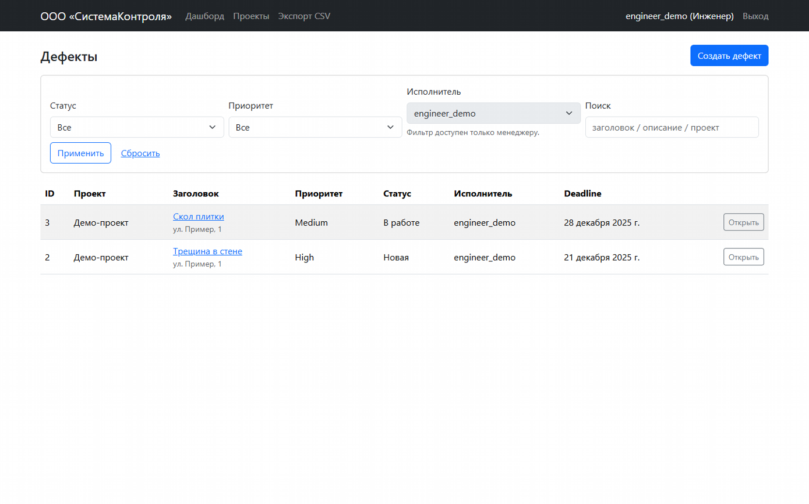
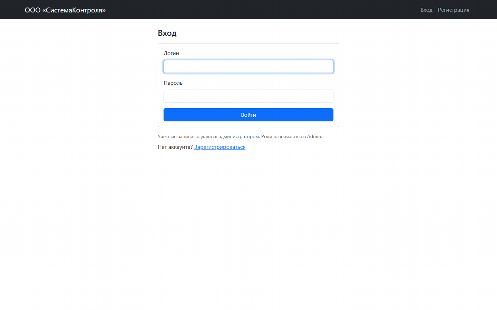
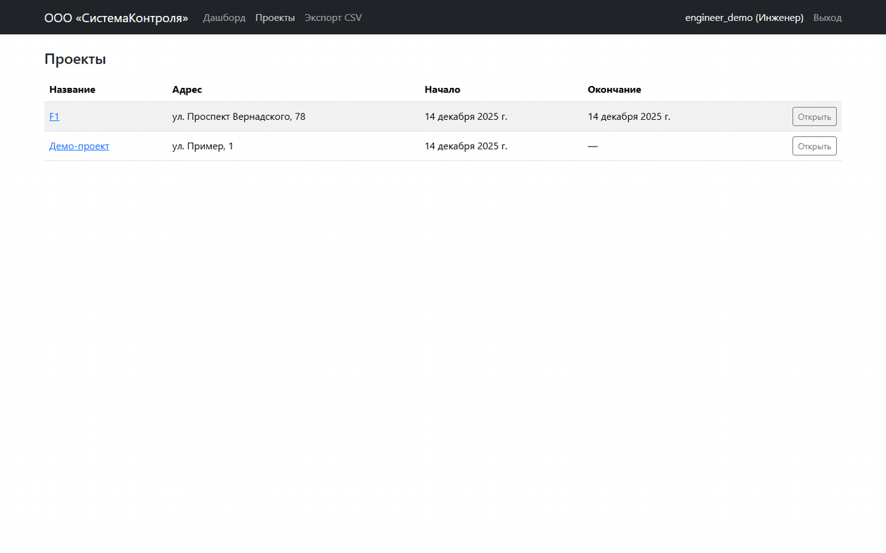
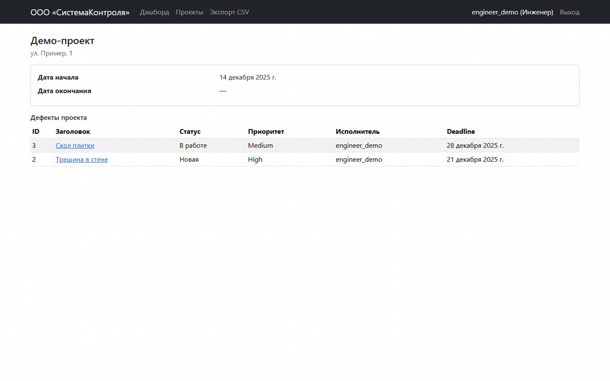
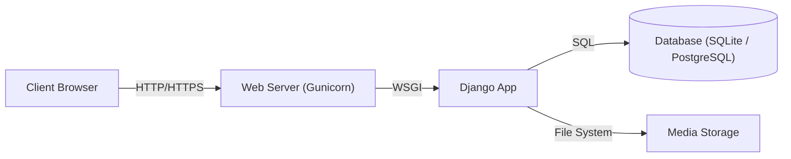
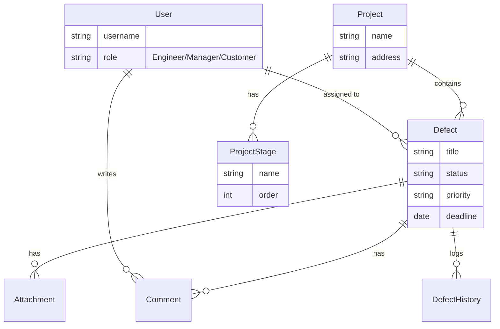
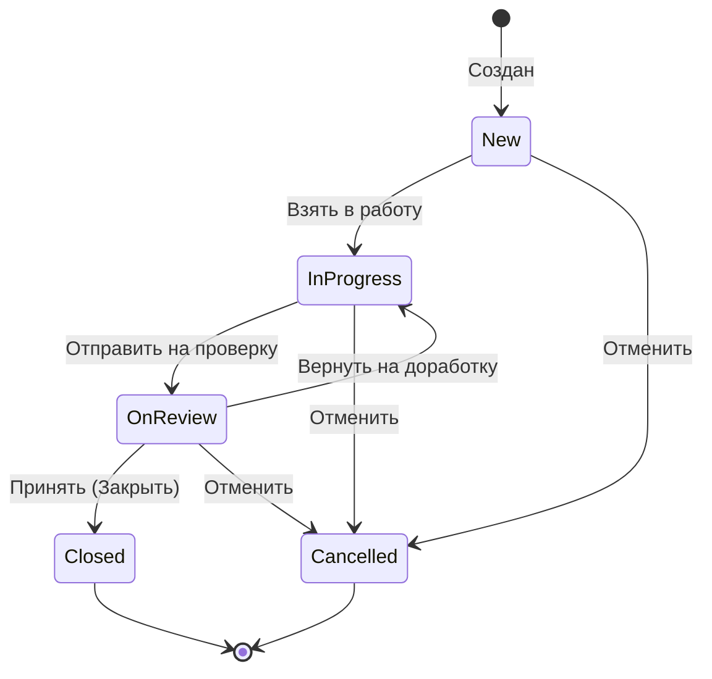

# СистемаКонтроля (SystemControl)


**СистемаКонтроля** — это монолитное веб-приложение для управления дефектами на строительных объектах. Система позволяет инженерам фиксировать нарушения, менеджерам — контролировать ход работ, а заказчикам — получать аналитику в реальном времени.



Подробная документация доступна в папке `docs/`:
- [Техническое задание (SRS)](docs/SRS.md)
- [User Stories](docs/user-stories.md)
- [Use Cases](docs/use-cases.md)
- [План тестирования](docs/test-plan.md)
- [Нагрузочное тестирование](docs/load-testing.md)
- [Резервное копирование](docs/backup.md)

---

## 📋 Функциональность

Приложение разработано в строгом соответствии с ТЗ (см. [docs/SRS.md](docs/SRS.md)).

### 1. Авторизация и Роли

*   **Безопасный вход**: Защита от подбора паролей, хеширование Argon2.
*   **Ролевая модель**:
    *   👷 **Инженер**: Работает только со своими задачами.
    *   👨‍💼 **Менеджер**: Полный контроль, назначение исполнителей.
    *   👔 **Заказчик**: Только просмотр и аналитика.

### 2. Управление Проектами

*   **Реестр объектов**: Удобный список строительных проектов.
*   **Детализация**: Просмотр этапов работ и статистики по каждому объекту.

### 3. Работа с Дефектами

*   **Полный цикл (CRUD)**: Создание, редактирование и закрытие дефектов.
*   **Workflow**: Строгая последовательность статусов (Новая → В работе → На проверке → Закрыта).
*   **История**: Логирование всех действий и комментарии.

### 4. Аналитика

*   **Дашборд**: Наглядная статистика по статусам и приоритетам.
*   **Фильтры**: Быстрый поиск узких мест.

---

## 🛠 Технический стек

*   **Backend**: Python 3.13, Django 5.2, Gunicorn
*   **Database**: PostgreSQL 16 (Docker) / SQLite (Local Dev)
*   **Infrastructure**: Docker, Docker Compose
*   **Testing**: Pytest (Unit/Integration), Locust (Load Testing)
*   **Security**: Argon2 (Password Hashing), Bandit (Security Linter)
*   **Frontend**: Django Templates + Bootstrap (Server-side rendering)

---
## 💾 Модели данных

Проект построен на **Django ORM**, что обеспечивает безопасность и удобство работы с данными.
*   **Схема**: Описание моделей `User`, `Project`, `Defect` и их связей см. в [docs/models.md](docs/models.md).
*   **Оптимизация**: Использование `select_related` и индексов для высокой производительности.
*   **Аудит**: История изменений сохраняется в JSON-формате.

---
## � Безопасность

Безопасность данных обеспечивается на нескольких уровнях:
*   **Хеширование паролей**: Используется алгоритм **Argon2**.
*   **RBAC**: Строгое разграничение прав доступа (Инженер/Менеджер/Заказчик).
*   **Защита заголовков**: CSRF, XSS, Clickjacking protection включены.
*   **Секреты**: Конфигурация через переменные окружения (`.env`).

Подробнее о реализации защиты читайте в [docs/security.md](docs/security.md).

---

## �📊 Визуализация и Архитектура

### 1. Архитектура приложения
Классическая монолитная архитектура. Поддерживает работу как с **SQLite** (для разработки), так и с **PostgreSQL** (в Docker/Production).



### 2. Схема базы данных (ER-диаграмма)
Основные сущности системы и их связи.



### 3. Workflow статусов дефекта
Жизненный цикл дефекта. Инженеры могут переводить только в "В работе" и "На проверке". Закрывать может только Менеджер.



---

## 🚀 Установка и запуск

Для развертывания потребуется установленный **Docker** и **Docker Compose**.

1.  **Клонируйте репозиторий:**
    ```bash
    git clone https://github.com/your-repo/system-control.git
    cd system-control
    ```

2.  **Настройте переменные окружения:**
    Создайте файл `.env` (можно скопировать пример, если есть, или использовать значения по умолчанию из `docker-compose.yml`):
    ```bash
    # .env
    POSTGRES_DB=sistemakontrol
    POSTGRES_USER=sistemakontrol
    POSTGRES_PASSWORD=secret
    DJANGO_SECRET_KEY=unsafe-secret-key
    DJANGO_DEBUG=1
    ```

3.  **Запустите контейнеры:**
    ```bash
    docker-compose up -d --build
    ```

4.  **Примените миграции и создайте администратора:**
    ```bash
    docker-compose exec web python manage.py migrate
    docker-compose exec web python manage.py createsuperuser
    ```

Приложение будет доступно по адресу: [http://localhost:8000](http://localhost:8000)

---

## ✅ Тестирование (Quality Assurance)

Проект покрыт тестами для обеспечения надежности и производительности. Подробный план тестирования: [docs/test-plan.md](docs/test-plan.md).

### Unit и Интеграционные тесты
Запуск тестов через `pytest`:
```bash
docker-compose exec web pytest
```

### Нагрузочное тестирование (Load Testing)
Проведено нагрузочное тестирование с использованием **Locust**. Подробный отчет: [docs/load-testing.md](docs/load-testing.md).

**Результаты (от 14.12.2025):**
*   **Параметры:** 50 пользователей, Spawn rate 10/sec.
*   **Ошибки (Failures):** 0% (HTTP 5xx = 0).
*   **Время отклика (Latency p95):**
    *   Dashboard (`/`): ~37 ms
    *   Projects (`/projects/`): ~26 ms
*   **Вывод:** SLA (время отклика < 1 сек) соблюден с многократным запасом. Система стабильна под нагрузкой.

---

## 🏆 Compliance Matrix (Чек-лист сдачи)

| Требование | Статус | Комментарий |
| :--- | :---: | :--- |
| **Архитектура** | ✅ | Монолит, Django, PostgreSQL, четкое разделение слоев. |
| **Тесты** | ✅ | Pytest (Unit/Integration) + Locust (Load). Coverage высокий. |
| **Безопасность** | ✅ | Хеширование паролей (Argon2), проверка Bandit, разграничение прав доступа. |
| **Docker** | ✅ | Полная контейнеризация (App + DB), docker-compose. |
| **Документация** | ✅ | Подробный README, Mermaid-диаграммы, полная документация в `docs/`. |
