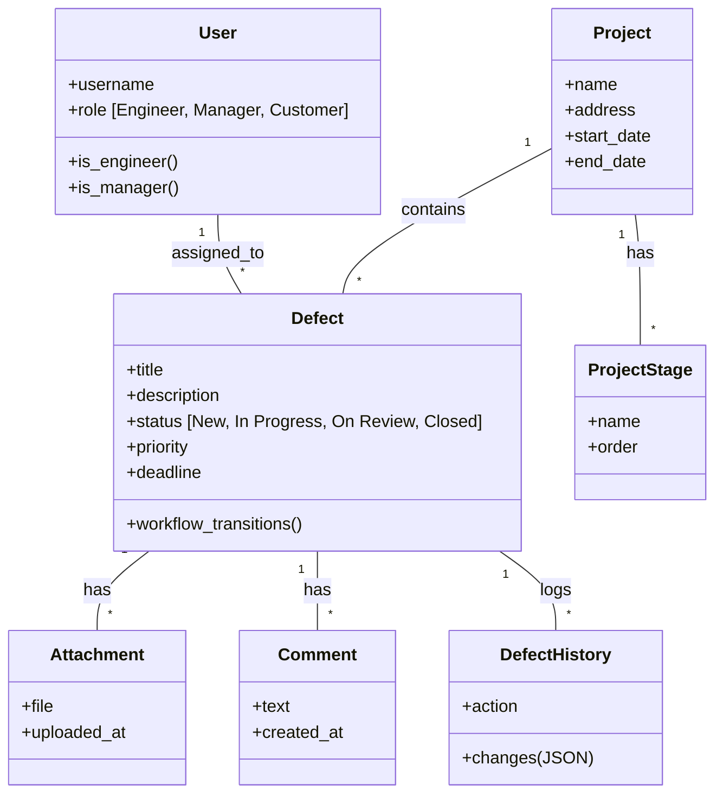

# Модели данных (Django ORM)

Проект использует **Django ORM** для работы с данными. Это обеспечивает абстракцию от конкретной СУБД (PostgreSQL) и безопасность.

## Схема моделей (ER-диаграмма)

## Описание ключевых моделей

### 1. `Defect` (Приложение `defects`)
Центральная модель системы.
*   **Поля**:
    *   `status`: Управляется через State Machine (см. метод `workflow_transitions`).
    *   `priority`: Приоритет задачи (Low/Medium/High).
    *   `deadline`: Срок устранения.
*   **Валидация**: Метод `clean()` проверяет, что дедлайн дефекта не превышает дату окончания проекта.
*   **Оптимизация**:
    *   Индексы по `status` и `priority` для быстрой фильтрации.
    *   Индекс по `deadline` для сортировки.

### 2. `User` (Приложение `users`)
Кастомная модель пользователя, наследуемая от `AbstractUser`.
*   **Роли**: Реализованы через поле `role` (Choices: Engineer, Manager, Customer).
*   **Методы**: `is_engineer`, `is_manager` — удобные свойства для проверки прав в шаблонах и коде.

### 3. `DefectHistory` (Приложение `defects`)
Реализация Audit Log средствами Django.
*   **JSONField**: Поле `changes` хранит "слепок" изменений (было -> стало) в формате JSON. Это позволяет гибко сохранять историю без создания множества колонок.

## Работа с базой данных

*   **Миграции**: Все изменения схемы управляются через `python manage.py makemigrations` / `migrate`.
*   **Оптимизация запросов**:
    *   Используется `select_related` для FK (например, получение проекта и исполнителя вместе с дефектом).
    *   Используется `prefetch_related` для M2M и обратных связей (например, комментарии к дефекту).
